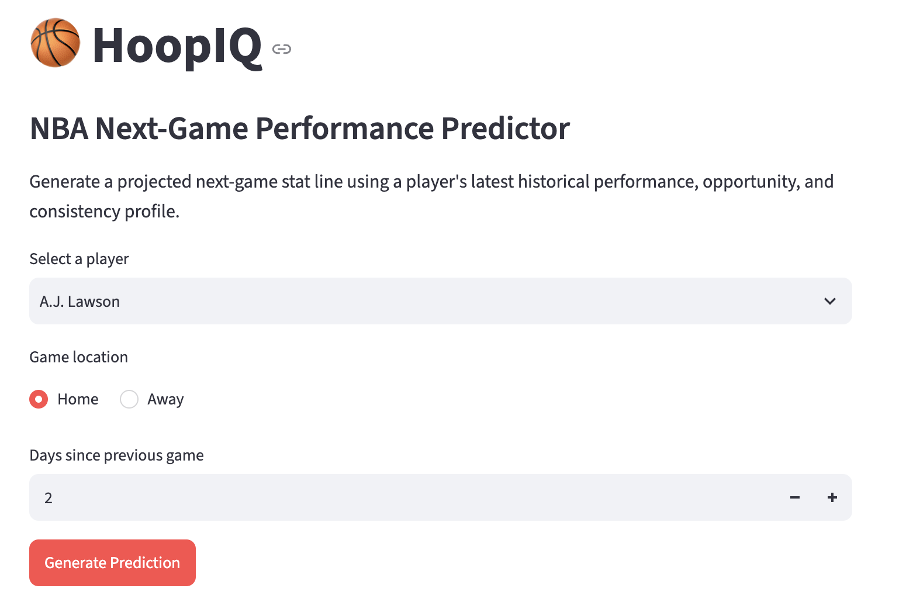
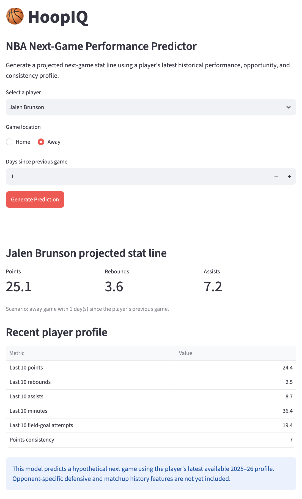

# 🏀 HoopIQ

### Predict NBA Player Performance Using Machine Learning

An end-to-end machine learning application that predicts an NBA player's next-game **points, rebounds, and assists** using historical NBA data, custom feature engineering, and predictive modeling.

---

## 🌐 Live Demo

**Application:** https://hoopiq-nba.streamlit.app/

**GitHub Repository:** https://github.com/devan-jariwala/HoopIQ

---

## 📸 Application Preview

### Homepage



### Example Prediction



---

# 🎯 Project Overview

HoopIQ is an end-to-end machine learning application that predicts an NBA player's next-game **points, rebounds, and assists** using historical NBA game data.

The project combines data engineering, feature engineering, machine learning, and web deployment into a complete analytics workflow. Rather than relying on simple season averages, HoopIQ learns from each player's recent performance, long-term trends, opportunity metrics, and consistency to generate predictions for a hypothetical next-game scenario.

The application was built entirely in Python using official NBA API data and deployed as an interactive Streamlit web application.

---

# ❓ Business Problem

Player performance prediction is one of the most challenging problems in sports analytics because every game is influenced by countless factors including recent performance, playing time, shooting volume, rest, and natural game-to-game variability.

The objective of HoopIQ is to answer the following business question:

> **Given everything known about a player before a game begins, can we accurately predict how many points, rebounds, and assists they will record?**

To answer this question, the project builds predictive models using only information that would have been available before tipoff, preventing data leakage while simulating a real-world prediction environment.

# ⚙️ Machine Learning Pipeline

The project follows a complete end-to-end machine learning workflow:

1. Collect historical NBA game logs using the official NBA API.
2. Clean and combine game data for every active NBA player.
3. Engineer pre-game features using only historical information.
4. Train predictive machine learning models.
5. Evaluate model performance on unseen future games.
6. Deploy the best-performing models as an interactive Streamlit web application.

The chronological train/test split ensures that every prediction is made using only information that would have been available before the game occurred, preventing data leakage.

---

# 📊 Dataset

- **Data Source:** Official NBA API
- **Season:** 2025–26 NBA Regular Season
- **Players Processed:** 464 active NBA players
- **Games:** 22,926 individual player-game observations

Each row in the dataset represents a single player's performance in a single NBA game.

---

# 🧠 Feature Engineering

Rather than using only season averages, HoopIQ creates historical pre-game features that better represent a player's current form.

## Historical Performance

- Previous Game
- Last 5 Game Average
- Last 10 Game Average
- Season Average

These features are generated for:

- Points
- Rebounds
- Assists
- Minutes Played
- Field Goal Attempts
- Three Point Attempts
- Free Throw Attempts

## Consistency Features

To capture player volatility, rolling standard deviations were calculated for recent games.

Examples include:

- Points Standard Deviation (Last 5)
- Points Standard Deviation (Last 10)
- Minutes Standard Deviation
- Shot Attempt Standard Deviation

These features help distinguish consistent players from players with highly variable performances.

## Context Features

Additional pre-game information includes:

- Home vs Away
- Days of Rest
- Games Played

All features are calculated using only games that occurred before the prediction target.

---

# 🤖 Models Evaluated

Two regression models were trained and compared for predicting:

- Points
- Rebounds
- Assists

### Linear Regression

A simple baseline model that learns linear relationships between engineered features and player performance.

### Random Forest Regressor

An ensemble learning algorithm that combines many decision trees to capture more complex relationships within the data.

Model performance was evaluated using:

- Mean Absolute Error (MAE)
- Root Mean Squared Error (RMSE)
- R² Score

---

# 📈 Results

Linear Regression consistently outperformed Random Forest across all three prediction tasks.

| Target | MAE | RMSE | R² |
|---------|----:|-----:|----:|
| Points | 4.81 | 6.27 | 0.458 |
| Rebounds | 1.90 | 2.50 | 0.438 |
| Assists | 1.41 | 1.93 | 0.481 |

On average, HoopIQ predicts:

- Points within approximately **5 points**
- Rebounds within approximately **2 rebounds**
- Assists within approximately **1.4 assists**

Feature importance analysis showed that recent production, season averages, shooting opportunity, and consistency metrics were among the strongest predictors.

---

# 🛠️ Technologies Used

### Programming

- Python

### Data

- pandas
- NumPy

### Machine Learning

- scikit-learn

### Data Collection

- nba_api

### Deployment

- Streamlit

### Model Serialization

- joblib

### Development

- VS Code
- Git
- GitHub

---

## 📁 Repository Structure

```text
HoopIQ/
├── app/
│   └── app.py
├── data/
│   └── processed/
├── images/
├── models/
│   ├── points_model.pkl
│   ├── rebounds_model.pkl
│   ├── assists_model.pkl
│   └── feature_columns.pkl
├── notebooks/
├── src/
├── requirements.txt
└── README.md
```

---

## ▶️ Run Locally

Clone the repository:

```bash
git clone https://github.com/devan-jariwala/HoopIQ.git
cd HoopIQ
```

Create and activate a virtual environment:

```bash
python3 -m venv .venv
source .venv/bin/activate
```

Install dependencies:

```bash
pip install -r requirements.txt
```

Launch the application:

```bash
streamlit run app/app.py
```

---

# 🚀 Future Improvements

Potential future enhancements include:

- Incorporating opponent defensive metrics
- Adding player-versus-opponent historical features
- Supporting upcoming NBA schedules automatically
- Including injury reports and projected minutes
- Experimenting with Gradient Boosting and XGBoost
- Predicting additional statistics such as steals, blocks, and three-pointers

---

# 💡 Key Takeaways

This project demonstrates the complete lifecycle of a machine learning application:

- Data collection
- Data cleaning
- Feature engineering
- Predictive modeling
- Model evaluation
- Deployment
- Software engineering best practices

Rather than focusing solely on model accuracy, HoopIQ emphasizes building a reproducible and deployable machine learning system that can be extended as additional basketball data becomes available.